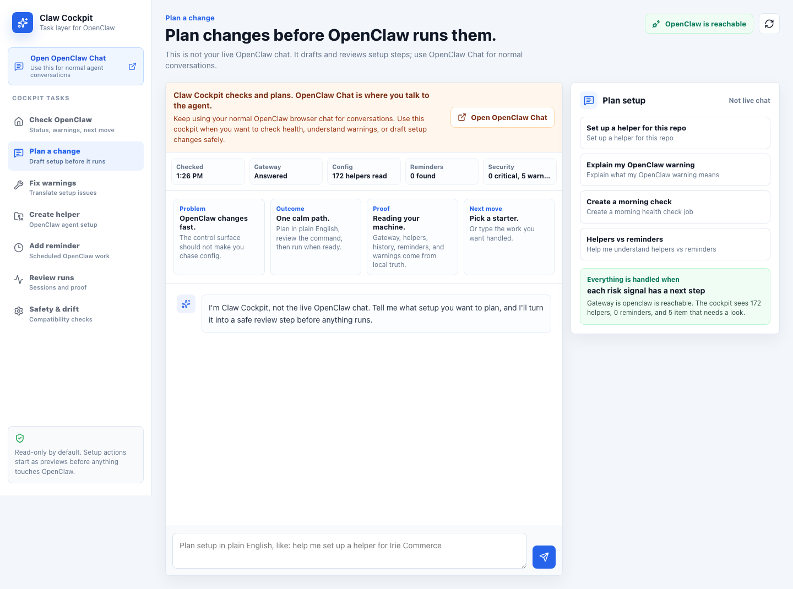
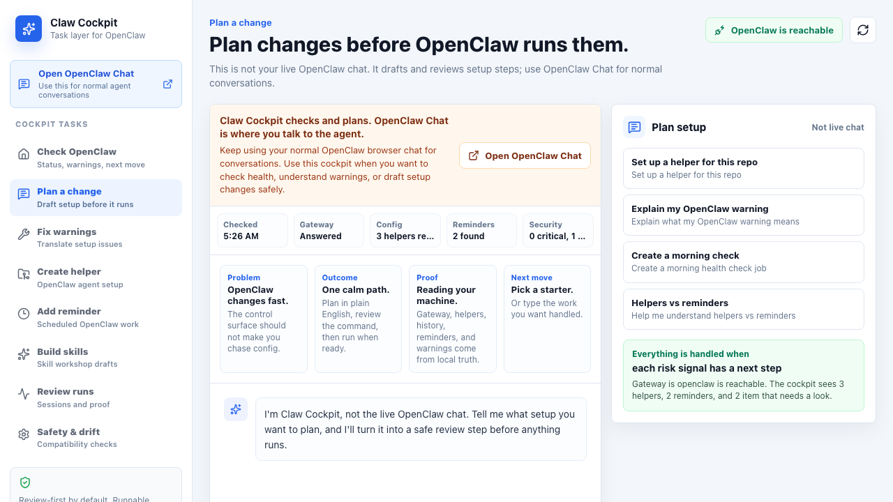
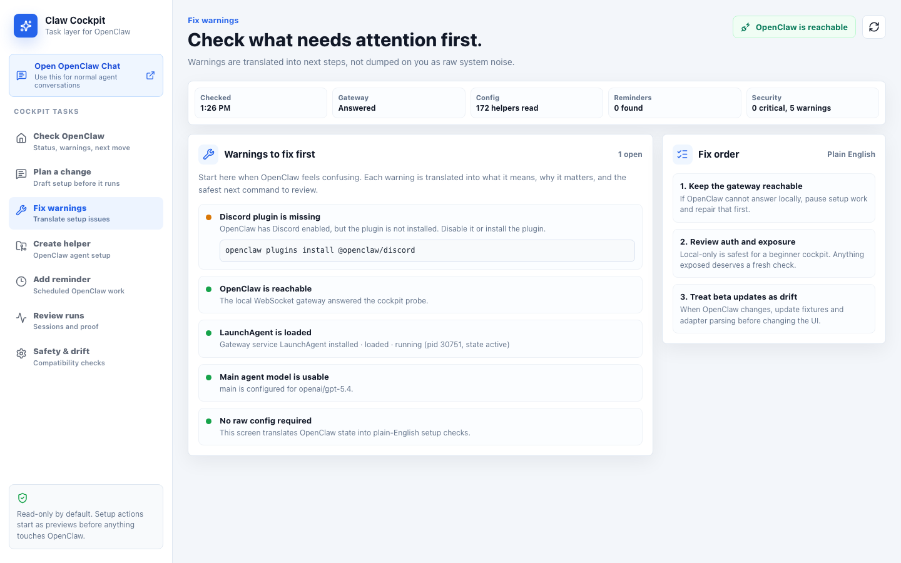
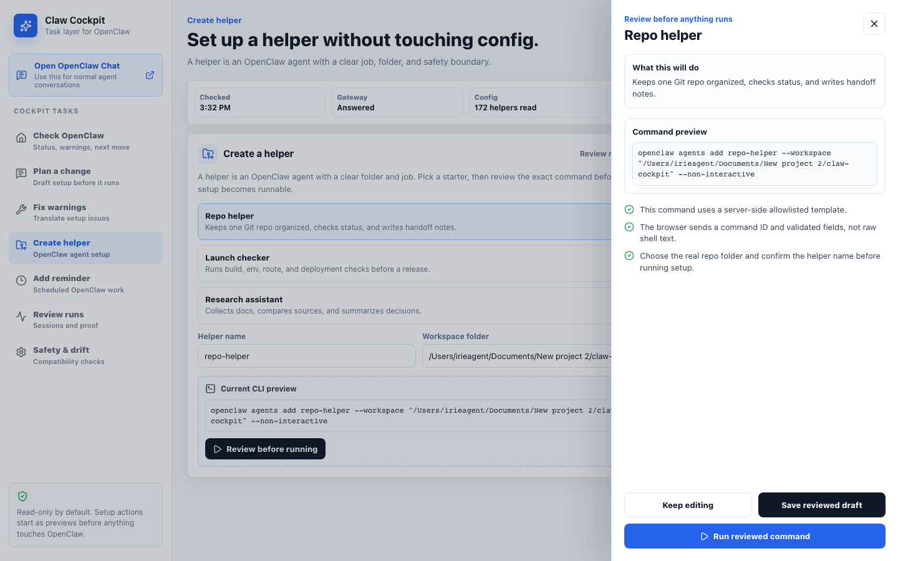

# Claw Cockpit

Task-focused local cockpit for OpenClaw.

[](https://github.com/corey470/claw-cockpit/actions/workflows/validate.yml)

Claw Cockpit is built for people who can get OpenClaw running, but do not want to live inside raw config, changing command flags, and scattered setup warnings. It does not depend on OpenClaw's own dashboard internals. Instead, it talks to the stable things operators already trust:

- the `openclaw` CLI
- the local gateway at `ws://127.0.0.1:18789`
- local state under `~/.openclaw`
- plain preview commands before any setup action runs

This is intentionally a beginner-readable repo. The code should be plain enough for a non-expert developer to follow, while still having real seams for contributors to extend.



## Product Goal

Make OpenClaw easier to operate without hiding the real system:

- check what OpenClaw sees right now
- plan setup changes before anything runs
- translate warnings into next steps
- draft helper and reminder commands from current CLI shape
- run reviewed helper/reminder setup through server-side allowlisted commands
- inventory local skills, draft new `SKILL.md` files, and install reviewed saved drafts
- write a reviewed plugin pack from saved skill drafts
- suggest real local workspace folders when setting up helpers
- show history, compatibility, and safety signals
- keep the adapter open enough for contributors to extend

[](docs/assets/claw-cockpit-demo.webm)

## Sidebar Model

The sidebar is task-first:

- `Open OpenClaw Chat` for normal agent conversations
- `Check OpenClaw` for status and next move
- `Plan a change` for reviewed setup drafts
- `Fix warnings` for setup diagnosis
- `Create helper` for OpenClaw agent setup
- `Add reminder` for scheduled OpenClaw work
- `Build skills` for skill inventory and draft creation
- `Review runs` for session proof
- `Safety & drift` for compatibility checks

## Setup Planner

The Setup Planner page is not the live OpenClaw chat. Use normal OpenClaw Chat for agent conversations.

The planner lets a beginner say what setup change they want in normal language, then turns that into:

- a short explanation
- the setup area to review next
- a command preview when a command is known

For now, replies are local guide rails only. They do not call a helper or change OpenClaw yet.

## First Run Walkthrough

1. Start OpenClaw normally.
2. Run Claw Cockpit with `npm run dev`.
3. Use `Open OpenClaw Chat` for normal agent conversations.
4. Use `Plan a change` when you want a setup command drafted in plain English.
5. Use `Fix warnings` when OpenClaw reports something confusing.
6. Use `Create helper` or `Add reminder` to draft setup work before anything runs.
7. Use the workspace chips when you want a helper pointed at a real local project folder.
8. Use `Build skills` when you want to shape OpenClaw with a new reviewed skill draft.
9. Install a saved skill draft only after the detail panel shows the file and install target you expect.
10. Use `Safety & drift` after OpenClaw updates to see what the adapter is worried about.



## Review Step

Command previews open a review drawer before anything can become executable. The drawer explains:

- what the command is meant to do
- the exact command text
- what still needs to be confirmed

Reviewed commands are saved as local setup drafts in the planning flow.

Helper, reminder, gateway restart, deep security audit, main model repair, and Discord plugin install drafts can be run from the review drawer after the command passes the server-side catalog. Other warning/doctor commands stay preview-only until each one has its own allowlisted template.



## Skill Workshop

The Skill Workshop is the first step toward making Claw Cockpit a friendly skill-building surface for OpenClaw users.

It can:

- scan local skill folders
- show plain-English quality signals
- draft a new `SKILL.md` from beginner-friendly fields
- open the draft in the same review drawer used by command previews
- save reviewed drafts under `~/.openclaw/claw-cockpit/skill-drafts/`
- install a saved draft into `~/.codex/skills` or `COCKPIT_INSTALL_SKILL_DIR`
- preview and save a starter plugin pack from one or more saved drafts

The install action is intentionally narrow: it only copies a saved draft by skill name after the review drawer, refuses conflicting existing `SKILL.md` files, and marks the saved draft as installed. Plugin pack writing is narrow too: it writes a `.codex-plugin/plugin.json`, a `marketplace-entry.json`, copied saved skill files, and Cockpit metadata only after the user reviews the preview.

## Run Locally

```bash
npm install
npm run dev
```

Then open:

```text
http://127.0.0.1:4320
```

The local adapter runs on `127.0.0.1:4314` and the Vite app proxies `/api/*` to it.

With the dev server running, check the adapter contract:

```bash
npm run smoke:overview
npm run smoke:workspaces
npm run smoke:skills
npm run smoke:ui
```

GitHub Actions runs `npm run ci:smoke` against redacted fixtures, so contributors can validate the app even if they do not have OpenClaw installed locally.

## Safety Model

The default posture is review-first:

- `/api/overview` reads OpenClaw status, gateway probe output, `openclaw.json`, and cron jobs.
- setup cards show command previews first.
- `/api/commands/run` accepts only server-side command IDs, validated fields, and explicit confirmation.
- `/api/skills/draft` returns draft file content only; it does not write or install skills.
- `/api/skills/drafts/save` regenerates the reviewed draft server-side and writes only under the Cockpit draft folder.
- `/api/skills/drafts/install` copies only a saved draft, requires explicit confirmation, and refuses to overwrite different existing skill files.
- `/api/skills/plugin-pack/draft` returns a preview only.
- `/api/skills/plugin-pack/save` writes only reviewed plugin files and refuses conflicting existing files.
- `/api/workspaces` returns local folder suggestions and never accepts browser-supplied shell commands.
- command smoke tests use dry-run mode so CI never changes a live OpenClaw install.

## Open Source Posture

This repo should be useful to other OpenClaw operators, not just pretty.

The project is MIT licensed. The goal is to make a friendly first layer for OpenClaw users and a clear starter repo for contributors who want to help improve agent operations tooling.

Contributors should be able to add:

- new setup checks
- new command draft templates
- new skill draft templates and skill quality checks
- parser fixtures for OpenClaw updates
- safer run/review flows
- docs for non-expert operators

The best contribution keeps both sides true: easier for beginners, sturdier for operators.

## Product Direction

This repo should grow as an adapter-first cockpit, not as a clone of the fast-changing OpenClaw UI. When OpenClaw changes, update the adapter parser or command mapping while keeping the beginner workflow stable.

See `docs/FUTURE_PROOFING.md` for the compatibility contract, drift risks, and smoke-check expectations.

The adapter is split into source readers, parsers, compatibility scoring, and overview normalization. Start with `docs/BEGINNER_MAP.md` if you are new to the codebase.

Current source truth lives in `docs/CURRENT_STATUS.md`.

Architecture decisions live in `docs/adr/`:

- adapter anti-corruption layer
- overview contract versioning
- raw signal redaction
- command drafts before execution
- skill workshop drafts before install

## Current Readiness

Status refreshed on May 20, 2026. Use the badge at the top of this README for the latest GitHub validation.

Claw Cockpit is now ready for real local work as a review-first OpenClaw cockpit:

- status, warnings, helpers, reminders, sessions, and drift are readable
- confusing warnings get a plain-English meaning, ignore-or-not answer, and safest next move
- helper and reminder setup can be reviewed and run through the safe catalog
- local skills can be inventoried, reviewed, saved as `SKILL.md` drafts, and installed from saved drafts
- plugin packs can be previewed and written from saved drafts, including a marketplace entry file
- gateway restart, deep security audit, main model repair, and Discord plugin install warning fixes are runnable through reviewed command IDs
- helper setup can start from real workspace suggestions instead of manual path guessing
- command runs are audit-logged under the local OpenClaw home
- GitHub Actions validates the app with fixtures
- live local smoke checks validate your machine path

The remaining gap before calling it fully complete is broad command coverage: more config edits, more plugin actions, and more OpenClaw maintenance actions need their own allowlisted templates before they become runnable.

## Irie Product Philosophy

This app should follow `/Users/irieagent/Desktop/Skills for Web Design /IRIE_PRODUCT_PHILOSOPHY.md`.

For an agent-control product, that means:

- lead with control and visibility
- show what changed, what still needs attention, and what is safe to do next
- make approval and verification part of the main flow
- keep copy plain enough for a beginner who has never touched OpenClaw config
- avoid generic AI dashboard filler
- use task words first: Check OpenClaw, Plan a change, Fix warnings, Create helper, Add reminder, Build skills, Review runs, Safety & drift
